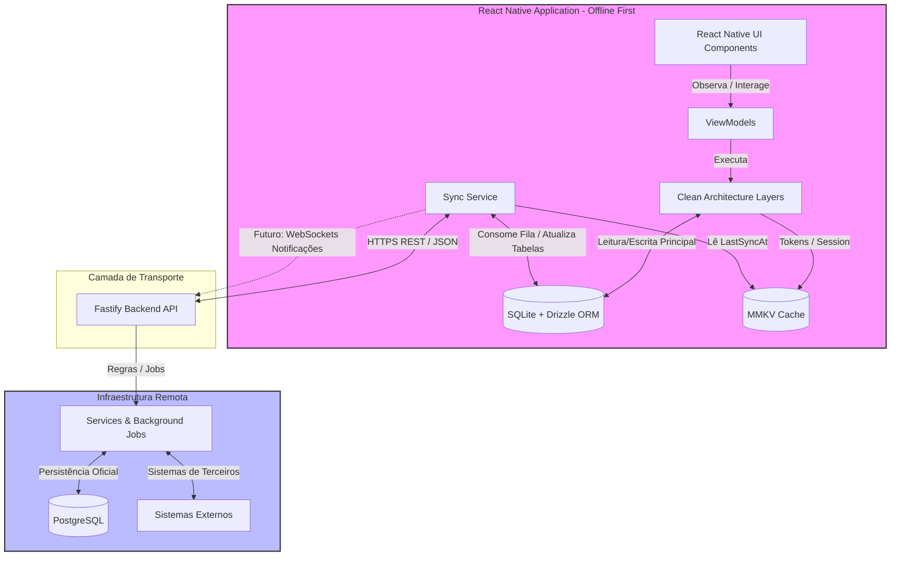
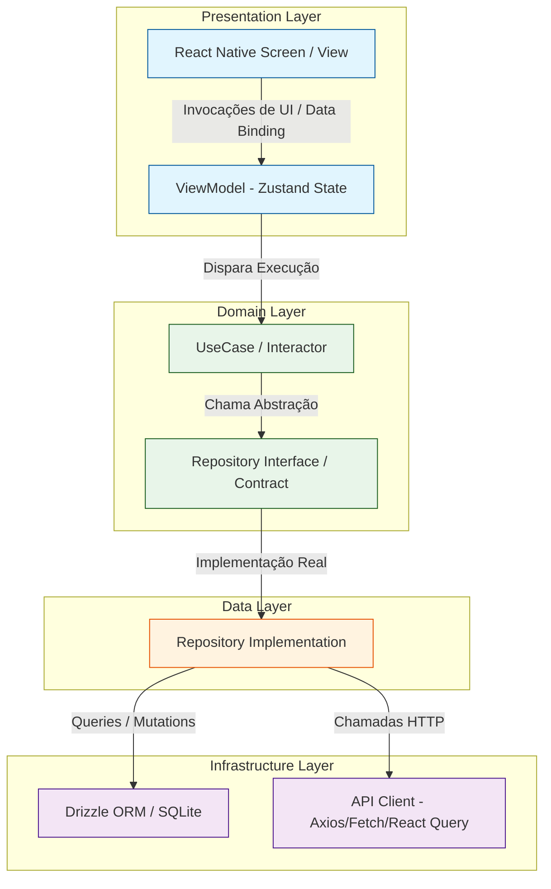
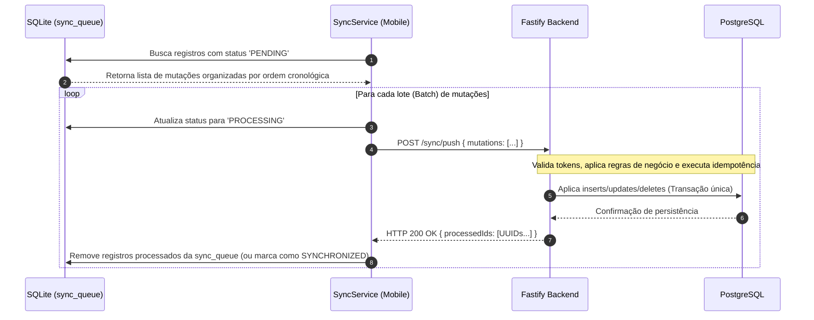
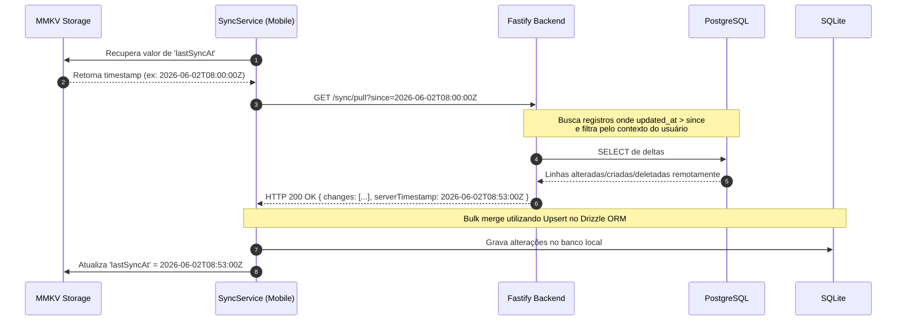
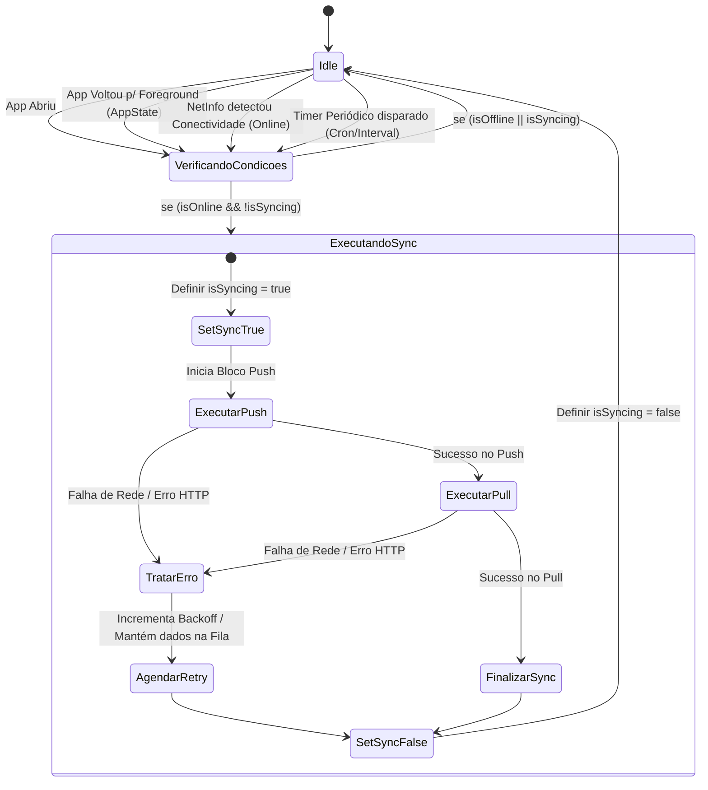
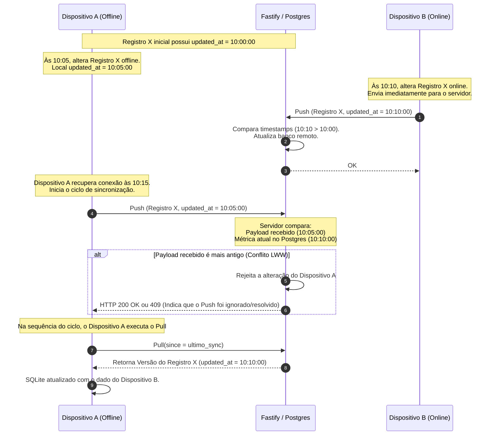

Construir aplicativos que dependem de conexão contínua com a internet para todas as ações do usuário é uma receita para frustração. Em cenários reais — como uso em trânsito, elevadores, galpões logísticos ou simplesmente redes móveis instáveis —, as requisições falham e a experiência de uso é severamente comprometida. 

A abordagem **Offline-First** inverte essa dinâmica: a interface do usuário lê e escreve exclusivamente em um banco de dados local presente no dispositivo móvel. Toda e qualquer sincronização com a infraestrutura de backend ocorre em segundo plano, de forma assíncrona, robusta e resiliente.

Neste artigo, detalho a engenharia por trás de uma solução offline-first projetada para sistemas corporativos de missão crítica.

---

### Ficha Técnica do Sistema
*   **Mobile:** React Native | Drizzle ORM + SQLite (persistência relacional local) | MMKV (armazenamento key-value rápido para tokens e timestamps) | Zustand (gerenciamento de estado leve e reativo)
*   **Backend:** Fastify | PostgreSQL (consistência relacional centralizada)
*   **Padrões:** Clean Architecture + MVVM + Resolução de conflitos baseada em tempo (*Last Write Wins* - LWW)

---

## 1. Arquitetura Geral do Sistema

A chave de um aplicativo offline-first confiável é o **desacoplamento total** entre a camada visual (UI) e os serviços de transporte de rede. O fluxo principal é síncrono e imediato sobre o banco local, enquanto um serviço autônomo gerencia a sincronização assíncrona com o backend.

### Componentes-Chave no Dispositivo Móvel:
-   **SQLite + Drizzle ORM:** Persistência relacional de alto desempenho com suporte a type safety. Toda leitura de tela vem diretamente do SQLite.
-   **MMKV Cache:** Storage chave-valor ultrarrápido rodando nativamente via JSI (JavaScript Interface), ideal para armazenar metadados críticos como o token de autenticação e o cursor da última sincronização bem-sucedida (`lastSyncAt`).
-   **Sync Service:** Thread/Serviço encarregado de processar a fila local de alterações pendentes de envio (Push) e baixar as atualizações do servidor (Pull).

---

## 2. Estrutura Clean Architecture + MVVM

Para garantir que o código do aplicativo seja testável e escalável, dividimos o app em camadas bem definidas. A interface gráfica não se comunica diretamente com a camada de infraestrutura de dados ou de rede.

-   **Presentation Layer:** As telas React Native interagem apenas com a ViewModel (gerenciada por stores Zustand). A ViewModel expõe os estados necessários e as ações acionadas pelo usuário.
-   **Domain Layer:** Define as regras de negócio puras (UseCases) e os contratos abstratos de repositório. Essa camada não tem dependência de banco de dados ou de bibliotecas de terceiros.
-   **Data Layer & Infrastructure Layer:** A implementação concreta do repositório interage com o Drizzle ORM para gravar localmente. Quando uma mutação ocorre, a implementação do repositório grava o registro local no banco de dados e adiciona uma operação correspondente à tabela de fila de sincronização (`sync_queue`), marcando-a como pendente.

---

## 3. Fluxo de Sincronização: Push

O processo de **Push** envia os deltas (mutação local) capturados no dispositivo móvel em direção ao backend. Para garantir a confiabilidade sob conexões instáveis, o mecanismo utiliza um loteamento (*batching*) cronológico com garantia de idempotência.

### Detalhes de Confiabilidade:
1.  **Ordem Cronológica Estrita:** As operações locais devem ser aplicadas na mesma ordem no backend para evitar inconsistências lógicas (por exemplo, atualizar um registro antes dele ter sido criado).
2.  **Idempotência:** Cada mutação gerada no app carrega uma chave única de idempotência (`mutation_id`). Se a requisição cair antes do app receber a resposta HTTP 200, a próxima tentativa enviará a mesma chave, permitindo que o Fastify ignore gravações duplicadas no PostgreSQL.
3.  **Recuperação de Falhas:** Caso ocorra um erro de rede no meio do processamento, as mutações com status `PROCESSING` são resetadas para `PENDING` para reprocessamento na próxima oportunidade.

---

## 4. Fluxo de Sincronização: Pull

Enquanto o Push envia mutações, o **Pull** consome os deltas remotos de registros gerados por outros usuários ou sistemas externos no PostgreSQL. Ele é incremental, trazendo apenas o que mudou desde a última sincronização.

### Pontos Importantes do Pull:
-   **Cursor Incremental (`since`):** O cursor da última sincronização (`lastSyncAt`) é lido do cache rápido do MMKV.
-   **Bulk Upsert Local:** Ao receber os deltas, o app usa as instruções nativas de upsert do SQLite (via Drizzle) para inserir novos registros e atualizar dados modificados, resolvendo potenciais conflitos de chaves primárias.
-   **Consistência de Data do Servidor:** O valor de `lastSyncAt` gravado após o pull sempre vem da propriedade `serverTimestamp` retornada pela resposta HTTP. Isso previne qualquer dessincronização causada por relógios locais de aparelhos desregulados ou fusos horários alterados.

---

## 5. Orquestrador SyncJob

Para evitar que loops paralelos gerem concorrência de leitura e escrita nos arquivos do SQLite, o ciclo de sincronização é governado por um orquestrador centralizado baseado em uma máquina de estados finitos.

O `SyncJob` escuta eventos do ciclo de vida da aplicação (através do `AppState` do React Native) e de rede (via `@react-native-community/netinfo`). Caso ocorra uma falha de rede temporária durante o ciclo, um algoritmo com **Exponential Backoff** é acionado para reagendar uma nova tentativa, protegendo a rede do cliente e a infraestrutura de backend de loops infinitos de requisições.

---

## 6. Resolução de Conflitos: Last Write Wins (LWW)

Mutações distribuídas podem acarretar conflitos de concorrência: o que acontece se o Dispositivo A altera um registro localmente no mesmo instante em que o Dispositivo B modifica o mesmo registro conectado à internet?

Adotamos a estratégia de **Last Write Wins (LWW)** baseada no timestamp remoto, garantindo consistência determinística em todo o ecossistema do app.

### Análise de Caso Real:
1.  **Dispositivo B altera primeiro na nuvem:** A alteração do Dispositivo B atinge o banco central com o timestamp `10:10:00`.
2.  **Dispositivo A sincroniza depois, mas com dado antigo:** Quando o Dispositivo A envia sua mutação de `10:05:00` (gerada enquanto estava offline), o servidor rejeita a aplicação dessa mutação porque `10:10:00` (PostgreSQL) é posterior a `10:05:00`.
3.  **Soberania do Pull:** No final do ciclo, o Dispositivo A executa o Pull correspondente, recebe a atualização com timestamp `10:10:00` e sobrescreve localmente seu próprio dado defasado.

### Nota sobre Sincronia de Tempo local (NTP):
Para que o LWW seja estritamente justo, os relógios locais dos dispositivos móveis devem estar alinhados com o servidor. Implementamos um mecanismo de compensação (*time offset*) durante a inicialização do app: o cliente faz um ping leve ao backend, calcula a diferença entre o relógio local e o servidor e ajusta o cálculo de data das suas mutações locais, mitigando completamente desvios manuais de relógio efetuados pelos usuários.

---

## Conclusão

Projetar uma arquitetura Offline-First exige cautela redobrada em relação à consistência e persistência de dados. No entanto, o retorno sobre o investimento é claro: uma aplicação extremamente rápida que funciona em qualquer condição climática ou de infraestrutura, resultando em maior produtividade e excelente experiência do usuário.
