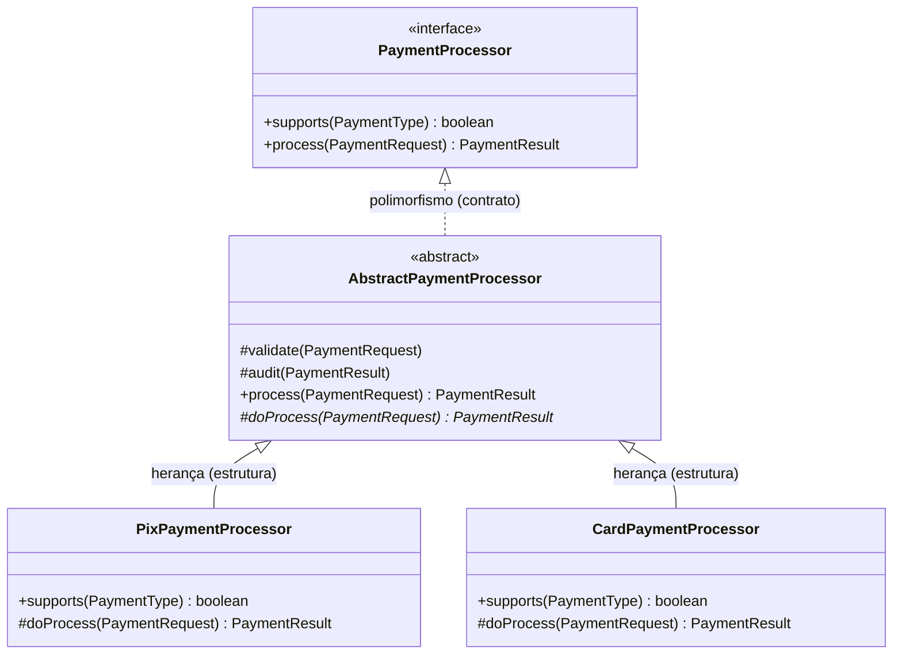
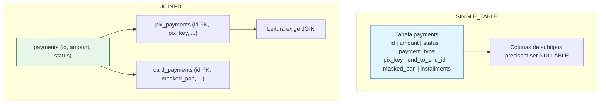
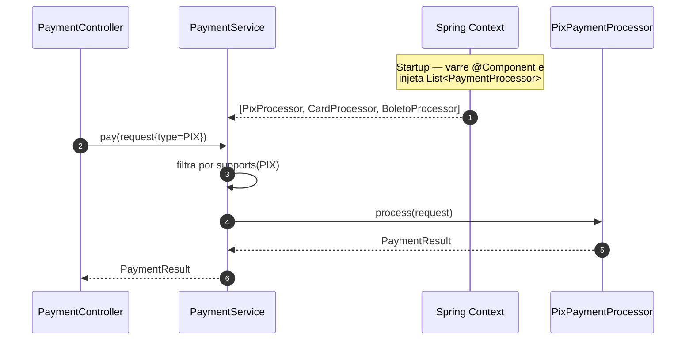

Herança e polimorfismo são os dois pilares da orientação a objetos que mais aparecem em entrevistas e menos aparecem, de forma consciente, no código de produção. Em aplicações Spring Boot, isso é irônico: o framework inteiro é construído sobre despacho polimórfico — quando você injeta uma interface e o container resolve a implementação concreta em runtime, é polimorfismo operando como infraestrutura.

O problema é que o uso ingênuo de herança em camadas de domínio e serviço costuma produzir hierarquias rígidas, difíceis de testar e de mapear no banco. Já o uso ingênuo de polimorfismo produz o oposto: cadeias de `if/else` e `instanceof` espalhadas, que anulam justamente o benefício de ter tipos distintos.

Neste artigo, detalho onde cada mecanismo rende ganho real em uma aplicação Spring Boot — persistência, camada de serviço, injeção de dependências e serialização — e onde ele cobra um preço alto demais.

---

### Ficha Técnica do Tema
*   **Herança (`extends`):** reuso de estrutura e comportamento, acoplamento em tempo de compilação
*   **Polimorfismo (`implements` + despacho dinâmico):** resolução do comportamento em runtime, acoplamento por contrato
*   **No Spring:** injeção por interface, `List<T>` de implementações, `@Qualifier`, `@ConditionalOnProperty`
*   **No JPA:** `@MappedSuperclass`, `@Inheritance` (`SINGLE_TABLE` | `JOINED` | `TABLE_PER_CLASS`), `@DiscriminatorColumn`
*   **Na serialização:** `@JsonTypeInfo` + `@JsonSubTypes` (Jackson)
*   **Padrões relacionados:** Strategy, Template Method, Factory, Open/Closed Principle

---

## 1. Duas Coisas Diferentes com o Mesmo Nome

Vale separar os conceitos antes de escrever qualquer linha de código, porque o Spring trata os dois de formas completamente distintas.

**Herança** é uma relação estática entre classes: `PixPayment extends Payment` significa que a subclasse carrega campos e métodos da superclasse, resolvidos em tempo de compilação. É reuso de *implementação*.

**Polimorfismo** é a capacidade de uma mesma chamada resolver para implementações diferentes em runtime, com base no tipo real do objeto. É reuso de *contrato*.



A regra prática que guia todo o resto do artigo: **o contrato deve ser uma interface; a herança entra apenas quando há estrutura ou fluxo genuinamente comum a compartilhar.** Interface primeiro, classe abstrata depois — nunca o contrário.

---

## 2. Herança de Estrutura: `@MappedSuperclass`

O caso mais seguro e mais comum de herança em Spring Boot é o de campos de auditoria repetidos em todas as entidades. Aqui a herança não expressa "é um tipo de" — expressa apenas reuso de colunas.

```java
@MappedSuperclass
@EntityListeners(AuditingEntityListener.class)
public abstract class BaseEntity {

    @Id
    @GeneratedValue(strategy = GenerationType.UUID)
    private UUID id;

    @CreatedDate
    @Column(updatable = false)
    private Instant createdAt;

    @LastModifiedDate
    private Instant updatedAt;

    @Version
    private Long version;

    // getters/setters
}
```

```java
@Entity
@Table(name = "customers")
public class Customer extends BaseEntity {

    @Column(nullable = false)
    private String name;

    @Column(nullable = false, unique = true)
    private String email;
}
```

`@MappedSuperclass` **não cria tabela e não é uma entidade**: o JPA simplesmente copia os campos herdados para a tabela de cada subclasse. Não existe relacionamento polimórfico possível com `BaseEntity` — você nunca consegue fazer `find(BaseEntity.class, id)`. E é exatamente isso que torna essa herança barata: ela não impõe nenhuma restrição ao modelo relacional.

Para habilitar o preenchimento automático de `createdAt` e `updatedAt`:

```java
@Configuration
@EnableJpaAuditing
public class JpaConfig { }
```

---

## 3. Herança de Entidades no JPA: Escolhendo a Estratégia

Quando a hierarquia é de domínio real — `Payment` com subtipos `PixPayment`, `CardPayment`, `BoletoPayment` — a decisão passa a ter impacto direto no schema e no plano de execução das queries.

```java
@Entity
@Inheritance(strategy = InheritanceType.SINGLE_TABLE)
@DiscriminatorColumn(name = "payment_type", discriminatorType = DiscriminatorType.STRING)
public abstract class Payment extends BaseEntity {

    @Column(nullable = false)
    private BigDecimal amount;

    @Enumerated(EnumType.STRING)
    private PaymentStatus status;

    public abstract PaymentType getType();
}

@Entity
@DiscriminatorValue("PIX")
public class PixPayment extends Payment {

    private String pixKey;
    private String endToEndId;

    @Override
    public PaymentType getType() {
        return PaymentType.PIX;
    }
}

@Entity
@DiscriminatorValue("CARD")
public class CardPayment extends Payment {

    private String maskedPan;
    private Integer installments;

    @Override
    public PaymentType getType() {
        return PaymentType.CARD;
    }
}
```



### Comparativo das estratégias

| Estratégia          | Schema                                  | Performance de leitura | Integridade (NOT NULL) | Quando usar |
|---------------------|-----------------------------------------|:----------------------:|:----------------------:|-------------|
| `SINGLE_TABLE`      | 1 tabela com todas as colunas           | Melhor (sem JOIN)      | Fraca — colunas de subtipo precisam ser nullable | Poucos subtipos, poucos campos exclusivos |
| `JOINED`            | 1 tabela base + 1 por subtipo           | JOIN por consulta      | Forte — cada tabela valida o próprio schema | Subtipos com muitos campos próprios e regras de obrigatoriedade |
| `TABLE_PER_CLASS`   | 1 tabela completa por subtipo concreto  | Pior em queries polimórficas (`UNION ALL`) | Forte | Subtipos raramente consultados juntos |

`SINGLE_TABLE` é o padrão do JPA e o mais rápido, mas o custo aparece no banco: toda coluna exclusiva de um subtipo precisa aceitar `NULL`, o que transfere a validação de obrigatoriedade inteiramente para a aplicação. `JOINED` preserva a integridade relacional ao preço de um JOIN por leitura. `TABLE_PER_CLASS` raramente compensa — queries pela superclasse viram `UNION ALL` entre todas as tabelas.

Repositórios funcionam polimorficamente sem esforço adicional:

```java
public interface PaymentRepository extends JpaRepository<Payment, UUID> { }

// devolve instâncias concretas de PixPayment / CardPayment
List<Payment> all = paymentRepository.findAll();
```

---

## 4. Polimorfismo no Container: Injetando Todas as Implementações

Aqui está o uso mais valioso de polimorfismo em Spring Boot, e o que mais reduz `if/else` no código de aplicação. O container consegue injetar **todos os beans que implementam uma interface** em uma `List` ou `Map`.

```java
public interface PaymentProcessor {
    boolean supports(PaymentType type);
    PaymentResult process(PaymentRequest request);
}
```

```java
@Service
public class PaymentService {

    private final List<PaymentProcessor> processors;

    public PaymentService(List<PaymentProcessor> processors) {
        this.processors = processors;
    }

    public PaymentResult pay(PaymentRequest request) {
        return processors.stream()
                .filter(p -> p.supports(request.type()))
                .findFirst()
                .orElseThrow(() -> new UnsupportedPaymentTypeException(request.type()))
                .process(request);
    }
}
```

Adicionar suporte a um novo meio de pagamento passa a ser uma operação **aditiva**: basta criar uma nova classe anotada com `@Component`. Nenhum arquivo existente é alterado — é o Open/Closed Principle materializado pelo container.



Para acesso O(1) em vez de varredura da lista, o Spring também injeta um `Map<String, T>` cujas chaves são os nomes dos beans — ou você mesmo indexa por um enum no construtor:

```java
@Service
public class PaymentService {

    private final Map<PaymentType, PaymentProcessor> byType;

    public PaymentService(List<PaymentProcessor> processors) {
        this.byType = processors.stream()
                .collect(Collectors.toMap(PaymentProcessor::type, Function.identity()));
    }
}
```

Quando existe mais de um candidato e você precisa de **um** específico, as ferramentas são `@Primary` (default do sistema), `@Qualifier("nome")` (escolha explícita no ponto de injeção) e `@ConditionalOnProperty` (escolha por configuração de ambiente).

---

## 5. Herança de Comportamento: Template Method

A classe abstrata entra quando as implementações compartilham um **fluxo**, não apenas uma assinatura: validar → executar → auditar, onde só o passo do meio varia.

```java
public abstract class AbstractPaymentProcessor implements PaymentProcessor {

    private final AuditService auditService;

    protected AbstractPaymentProcessor(AuditService auditService) {
        this.auditService = auditService;
    }

    @Override
    public final PaymentResult process(PaymentRequest request) {
        validate(request);
        PaymentResult result = doProcess(request);
        auditService.record(request, result);
        return result;
    }

    protected void validate(PaymentRequest request) {
        if (request.amount().signum() <= 0) {
            throw new InvalidAmountException(request.amount());
        }
    }

    protected abstract PaymentResult doProcess(PaymentRequest request);
}
```

```java
@Component
public class PixPaymentProcessor extends AbstractPaymentProcessor {

    private final PixGateway gateway;

    public PixPaymentProcessor(AuditService auditService, PixGateway gateway) {
        super(auditService);
        this.gateway = gateway;
    }

    @Override
    public boolean supports(PaymentType type) {
        return type == PaymentType.PIX;
    }

    @Override
    protected PaymentResult doProcess(PaymentRequest request) {
        return gateway.send(request);
    }
}
```

O `final` em `process` é deliberado: ele garante que nenhuma subclasse consiga pular a validação ou a auditoria. Herança sem `final` no método-template é um convite a subclasses que quebram invariantes silenciosamente.

Note também o custo desse desenho: toda subclasse precisa repassar dependências da superclasse pelo construtor. Quando a lista de dependências comuns cresce, esse acoplamento é o sinal de que composição (injetar um colaborador) seria melhor que herança.

---

## 6. Polimorfismo na Borda: Serialização com Jackson

Hierarquias de domínio precisam atravessar a fronteira HTTP. Por padrão, Jackson serializa apenas os campos do tipo declarado e não sabe reconstruir o subtipo correto na desserialização. A solução é declarar o mapeamento de tipos:

```java
@JsonTypeInfo(
    use = JsonTypeInfo.Id.NAME,
    include = JsonTypeInfo.As.PROPERTY,
    property = "type"
)
@JsonSubTypes({
    @JsonSubTypes.Type(value = PixPaymentRequest.class, name = "PIX"),
    @JsonSubTypes.Type(value = CardPaymentRequest.class, name = "CARD")
})
public sealed interface PaymentRequest permits PixPaymentRequest, CardPaymentRequest {
    BigDecimal amount();
}

public record PixPaymentRequest(BigDecimal amount, String pixKey) implements PaymentRequest { }

public record CardPaymentRequest(BigDecimal amount, String pan, Integer installments) implements PaymentRequest { }
```

Com isso, um `@RequestBody PaymentRequest` chega ao controller já instanciado como o subtipo correto, com validação específica por tipo. O uso de `sealed` (Java 17+) fecha a hierarquia e permite ao compilador verificar exaustividade em `switch` de padrões — um polimorfismo verificado em tempo de compilação, útil justamente nos casos em que o comportamento pertence a quem consome, e não à entidade.

> **Cuidado com desserialização polimórfica em endpoints públicos:** `JsonTypeInfo.Id.CLASS` (que aceita nomes de classe arbitrários vindos do cliente) já foi vetor de execução remota de código. Use sempre `Id.NAME` com `@JsonSubTypes` explícitos ou `sealed`, restringindo a hierarquia a tipos conhecidos.

---

## 7. Armadilhas Comuns

1.  **`instanceof` em cadeia dentro do serviço:** se o código precisa perguntar o tipo concreto para decidir o comportamento, o comportamento está na classe errada. Mova-o para o subtipo ou para uma `Strategy` — o `instanceof` é o sintoma clássico de polimorfismo não aplicado.
2.  **Herdar para reaproveitar código sem relação "é-um":** `ReportService extends BaseService` só para reusar um método utilitário cria acoplamento permanente. Herança é a forma mais forte de acoplamento em Java; para reuso puro, use composição ou um componente injetado.
3.  **`@Transactional` em método de classe abstrata chamando método sobrescrito:** o proxy do Spring só intercepta chamadas **externas** ao bean. Chamadas internas (`this.doProcess(...)`) não passam pelo proxy, então anotações no método interno são ignoradas. Coloque `@Transactional` no método público de entrada.
4.  **`equals`/`hashCode` em hierarquias de entidade JPA:** comparar por campos herdados quebra com proxies do Hibernate (`instanceof` falha contra `PixPayment$HibernateProxy`). Compare por ID e use `Hibernate.getClass(obj)` em vez de `obj.getClass()`.
5.  **`SINGLE_TABLE` com dezenas de subtipos:** a tabela vira um pântano de colunas nullable e a integridade migra inteiramente para a aplicação. Acima de três ou quatro subtipos com campos próprios, reavalie para `JOINED`.
6.  **Ambiguidade de bean sem `@Qualifier`:** duas implementações da mesma interface injetadas em um ponto singular derrubam o startup com `NoUniqueBeanDefinitionException`. Decida entre `@Primary`, `@Qualifier` ou injeção da lista completa — falhar no startup é o comportamento desejável, não um bug.

---

## Conclusão

Herança e polimorfismo resolvem problemas diferentes e devem ser decididos separadamente. O polimorfismo — via interfaces e injeção de dependências — é o mecanismo que torna uma aplicação Spring Boot extensível: novos comportamentos entram como novas classes, sem tocar no código existente. A herança é uma ferramenta mais estreita, que rende bem em dois cenários específicos (campos comuns via `@MappedSuperclass` e fluxos compartilhados via Template Method) e envelhece mal em praticamente todos os outros.

O teste prático é simples: se adicionar um novo caso ao sistema exige editar um `switch`, um `if/else` ou uma classe existente, falta polimorfismo. Se adicionar uma nova subclasse exige entender três níveis de superclasse para saber o que será executado, sobra herança.
