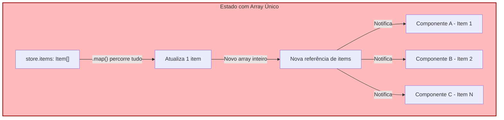
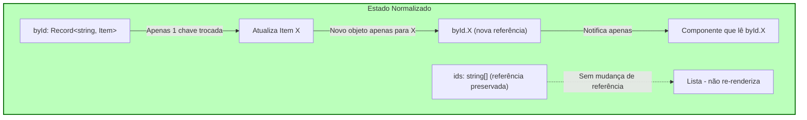
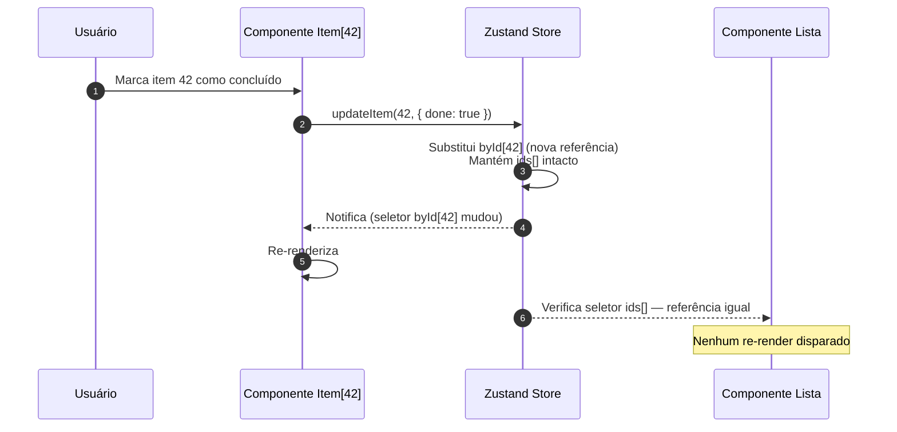
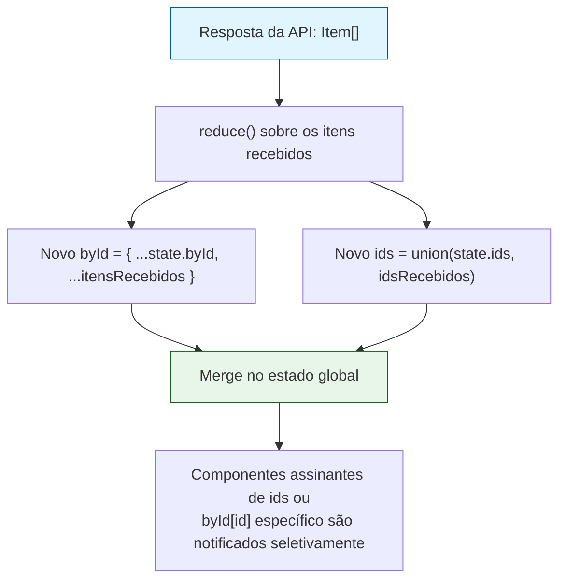

Manter listas grandes de objetos diretamente dentro de um único array no estado global é uma das causas mais comuns de degradação de performance em aplicações React de médio e grande porte. Conforme a lista cresce — centenas ou milhares de itens —, operações triviais como atualizar um único registro, buscar um item por ID ou re-renderizar apenas o componente afetado se tornam progressivamente mais caras.

A solução amplamente adotada por bibliotecas maduras de gerenciamento de estado (Redux, com `createEntityAdapter` do Redux Toolkit, sendo o exemplo mais conhecido) é a **normalização de estado**: em vez de um array monolítico de objetos, o estado é dividido em duas estruturas complementares — um **array de IDs** (que preserva a ordem) e um **HashMap/dicionário** indexado por ID (que garante acesso O(1) a qualquer objeto).

Neste artigo, detalho a engenharia por trás desse padrão aplicado a uma store React (usando Zustand como exemplo, mas o princípio se aplica a Redux, Jotai ou Context API), incluindo os ganhos de performance, os trade-offs e as armadilhas comuns de implementação.

---

### Ficha Técnica do Padrão
*   **Estado bruto:** `Record<string, T>` (HashMap de entidades) + `string[]` (array ordenado de IDs)
*   **Acesso direto:** O(1) por ID, ao invés de O(n) via `.find()`
*   **Atualização:** Troca de referência apenas do objeto alterado, preservando referências dos demais
*   **Ferramentas:** Zustand + Immer (state slices) | Seletores memoizados (Reselect / `useShallow`)
*   **Padrões:** Normalized State Shape + Structural Sharing + Fine-Grained Selectors

---

## 1. O Problema: Array Monolítico de Objetos

Quando o estado global guarda uma lista como `items: Item[]`, qualquer atualização em um único item — por exemplo, marcar uma tarefa como concluída — exige a reconstrução de todo o array para respeitar a imutabilidade:

```ts
// Antes: array monolítico
set((state) => ({
  items: state.items.map((item) =>
    item.id === targetId ? { ...item, done: true } : item
  ),
}));
```

Essa operação tem custo **O(n)** tanto para localizar o item (`.map` percorre tudo) quanto para gerar um novo array. Pior: como o array inteiro é uma nova referência, **qualquer componente que dependa de `items`** — mesmo que só exiba um item específico que não mudou — é candidato a re-renderizar, a menos que existam seletores muito bem granulados.



O diagrama acima ilustra o problema central: **um dado muda, mas N componentes são notificados**, mesmo que apenas um deles realmente dependa do dado alterado.

---

## 2. A Estrutura Normalizada: `ids[]` + `byId{}`

A normalização separa a **ordem** da **identidade dos dados**:

```ts
interface NormalizedState<T> {
  ids: string[];                 // ordem de exibição/iteração
  byId: Record<string, T>;       // acesso direto por ID
}

interface ItemsState {
  items: NormalizedState<Item>;
}
```

Com essa estrutura, atualizar um único item se torna uma operação **O(1)** — apenas o objeto correspondente no `byId` é substituído, e o array `ids` permanece com a mesma referência (structural sharing):

```ts
set((state) => ({
  items: {
    ids: state.items.ids, // referência preservada — nada mudou aqui
    byId: {
      ...state.items.byId,
      [targetId]: { ...state.items.byId[targetId], done: true },
    },
  },
}));
```



### Por que isso importa na prática:
-   **Busca direta:** `byId[id]` é acesso O(1), eliminando a necessidade de `.find()` em listas grandes.
-   **Structural sharing:** como apenas a chave alterada recebe uma nova referência, seletores que leem *outros* itens do `byId` não detectam mudança e não disparam re-render.
-   **Ordem desacoplada:** reordenar a lista (drag-and-drop, ordenação por filtro) mexe apenas em `ids`, sem tocar nos objetos em si — e vice-versa.

---

## 3. Seletores Granulares: Isolando o Re-render por Item

O ganho de performance da normalização só se concretiza se os componentes consumirem o estado através de **seletores finos**, que assinam apenas a fatia relevante — nunca o objeto `byId` inteiro.

```ts
// ❌ Ruim: assina o hashmap inteiro, re-renderiza a cada mudança de qualquer item
const byId = useStore((state) => state.items.byId);

// ✅ Bom: assina apenas o item específico
const item = useStore((state) => state.items.byId[itemId]);

// ✅ Bom: componente de lista assina apenas a ordem
const ids = useStore((state) => state.items.ids);
```



Esse é o núcleo do ganho: a lista (`ids`) e os itens individuais (`byId[id]`) tornam-se **unidades de assinatura independentes**. Ao contrário do array monolítico, uma mudança em um item nunca propaga re-render para o componente de lista, nem para os demais itens.

---

## 4. Derivações: Filtros, Ordenação e Listas Computadas

Um ponto de atenção na normalização é que operações como filtrar ou ordenar deixam de ser triviais, já que não existe mais "o array" pronto — ele precisa ser reconstruído a partir de `ids` + `byId`.

```ts
// Seletor derivado, memoizado para evitar recomputo a cada render
const selectVisibleItems = (state: ItemsState) =>
  state.items.ids
    .map((id) => state.items.byId[id])
    .filter((item) => !item.archived);
```

Sem memoização, esse seletor cria um **novo array a cada chamada**, mesmo quando nada mudou — reintroduzindo o problema de re-renders desnecessários por outra via. A prática recomendada é envolver esses seletores com memoização (Reselect, `useMemo`, ou o helper `createSelector` de bibliotecas como Zustand + `zustand/middleware`):

```ts
import { createSelector } from "reselect";

const selectIds = (state: ItemsState) => state.items.ids;
const selectById = (state: ItemsState) => state.items.byId;

const selectVisibleItems = createSelector(
  [selectIds, selectById],
  (ids, byId) => ids.map((id) => byId[id]).filter((item) => !item.archived)
);
```

Dessa forma, o array derivado só é reconstruído quando `ids` ou `byId` de fato mudam de referência — preservando o benefício do structural sharing mesmo em listas computadas.

---

## 5. Fluxo de Atualização em Lote (Sync / Bulk Upsert)

Em cenários com sincronização de backend ou carregamento paginado, é comum receber múltiplos registros de uma vez. A normalização simplifica esse merge, já que inserir ou atualizar não exige percorrer o array existente:



```ts
function upsertMany(state: ItemsState, incoming: Item[]): ItemsState {
  const newById = { ...state.items.byId };
  const newIds = new Set(state.items.ids);

  for (const item of incoming) {
    newById[item.id] = item;
    newIds.add(item.id);
  }

  return {
    items: {
      byId: newById,
      ids: Array.from(newIds),
    },
  };
}
```

Note que apenas os itens efetivamente recebidos ganham novas referências em `byId` — os demais permanecem intactos, preservando structural sharing mesmo em operações de merge de centenas de registros.

---

## 6. Comparação de Complexidade

| Operação                          | Array Monolítico | Normalizado (`ids[]` + `byId{}`) |
|-----------------------------------|:-----------------:|:---------------------------------:|
| Buscar item por ID                | O(n)               | O(1)                              |
| Atualizar 1 item                  | O(n)               | O(1)                              |
| Inserir item                      | O(n) *(imutabilidade)* | O(1) amortizado              |
| Remover item                      | O(n)               | O(1) no `byId` + O(n) no `ids`    |
| Reordenar lista                   | O(n log n)         | O(n log n) *(apenas sobre `ids`)* |
| Re-render ao atualizar 1 item     | Potencialmente todos os itens | Apenas o item alterado |

A remoção é o único caso em que o `ids` ainda exige uma varredura O(n) para filtrar o ID removido — trade-off aceitável frente aos ganhos nas operações de leitura e atualização, que costumam ser muito mais frequentes.

---

## 7. Armadilhas Comuns

1.  **Selecionar o `byId` inteiro em componentes de item:** anula o benefício da normalização. Sempre selecione `byId[id]`, nunca `byId`.
2.  **Recriar arrays derivados sem memoização:** gera "re-render por referência nova" mesmo sem mudança real de dado — o oposto do que se buscava resolver.
3.  **Esquecer de sincronizar `ids` e `byId` em remoções:** remover apenas do `byId` deixa IDs "fantasmas" no array `ids`, causando erros de acesso (`undefined`) nos componentes de lista.
4.  **Aninhar objetos profundamente dentro de `byId[id]`:** normalizar apenas o primeiro nível não resolve re-renders causados por mutações em sub-objetos aninhados; nesses casos, considere normalizar também as relações aninhadas (padrão usado por bibliotecas como `normalizr`).

---

## Conclusão

Separar o estado global em um array de IDs e um HashMap de entidades é uma mudança estrutural simples que ataca diretamente as duas causas mais comuns de lentidão em listas grandes no React: buscas lineares e re-renders em cascata. O trade-off é uma leitura ligeiramente menos direta do estado (é preciso combinar `ids` e `byId` para reconstruir uma lista visual) — resolvido de forma elegante com seletores memoizados. Para aplicações com centenas ou milhares de registros em tela, esse padrão costuma ser a diferença entre uma interface fluida e uma interface perceptivelmente travada a cada interação.
