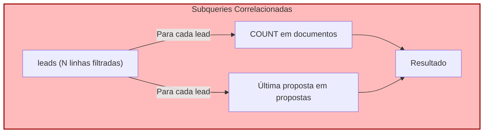
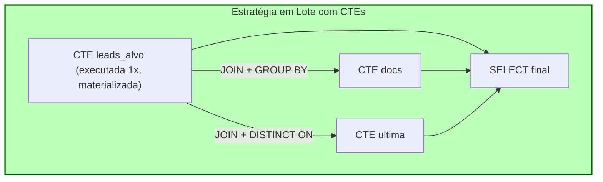

Common Table Expressions (CTEs) são uma das funcionalidades mais populares do SQL moderno, e também uma das mais mal compreendidas. Em muitos times, existe a crença de que "reescrever com CTE deixa a query mais rápida". Em outros, o oposto: "CTE é lenta, evite". As duas afirmações estão erradas, ou melhor, estão desatualizadas, porque o comportamento das CTEs no PostgreSQL mudou de forma significativa na versão 12.

Trabalhando no backend de uma plataforma de vendas com Node.js, TypeScript e PostgreSQL, me deparei várias vezes com queries que cresciam em complexidade junto com as regras de negócio: qualificação de leads, propostas, contratos e validação de documentos. Nessas queries, as CTEs foram uma ferramenta valiosa, mas só depois que entendi o que elas fazem por baixo dos panos.

Neste artigo, mostro como uso CTEs para otimizar queries, o que mudou a partir do PostgreSQL 12 e, principalmente, os cenários em que elas **não** ajudam (ou pioram) a performance.

> Os nomes de tabelas e colunas usados nos exemplos são fictícios e simplificados, inspirados em um domínio de vendas (leads, propostas, documentos). Os conceitos se aplicam a qualquer schema.

---

### Ficha Técnica do Padrão
*   **Recurso:** Common Table Expressions (`WITH ... AS`), não recursivas e recursivas
*   **Comportamento padrão (PG ≥ 12):** CTE não recursiva, sem efeitos colaterais e referenciada **uma única vez** é incorporada (*inlined*) à query principal; referenciada **mais de uma vez** é materializada
*   **Controle explícito:** `AS MATERIALIZED` e `AS NOT MATERIALIZED`
*   **Ferramentas de diagnóstico:** `EXPLAIN (ANALYZE, BUFFERS)`, `pg_stat_statements`
*   **Alternativas:** subqueries, `LATERAL`, `DISTINCT ON`, window functions, tabelas temporárias com índice

---

## 1. O Que Mudou no PostgreSQL 12

Antes da versão 12, toda CTE era uma **barreira de otimização** (*optimization fence*): o PostgreSQL executava a CTE inteira, guardava o resultado em memória (ou em disco, se grande) e só depois usava esse resultado na query principal. O planejador não conseguia "enxergar através" dela.

A partir do PostgreSQL 12, o comportamento padrão ficou mais inteligente:

| Tipo de CTE                                              | Comportamento padrão (PG ≥ 12) |
|----------------------------------------------------------|--------------------------------|
| Não recursiva, sem efeitos colaterais, usada 1 vez       | Incorporada à query (*inlined*) |
| Não recursiva, usada 2 ou mais vezes                     | Materializada                  |
| Recursiva                                                | Sempre materializada           |
| Com `INSERT`/`UPDATE`/`DELETE` (data-modifying)          | Sempre executada e materializada |

E você pode forçar o comportamento quando precisar:

```sql
-- Força a materialização (comportamento antigo)
WITH leads_ativos AS MATERIALIZED (
  SELECT id, nome FROM leads WHERE status = 'qualificado'
)
SELECT * FROM leads_ativos;

-- Força a incorporação à query principal
WITH leads_ativos AS NOT MATERIALIZED (
  SELECT id, nome FROM leads WHERE status = 'qualificado'
)
SELECT * FROM leads_ativos;
```

Esse detalhe é a chave para entender tudo o que vem a seguir: **a CTE em si não é "rápida" nem "lenta"; o que importa é se ela é materializada ou não, e o que isso faz com o plano de execução.**

---

## 2. O Cenário: Uma Listagem Cheia de Subqueries Correlacionadas

Imagine uma tela de listagem para o time comercial: para cada lead qualificado de um responsável, queremos mostrar quantos documentos estão pendentes de validação e o valor da última proposta enviada.

A primeira versão, escrita de forma incremental conforme os requisitos apareciam, costuma ficar assim:

```sql
SELECT
  l.id,
  l.nome,
  (
    SELECT COUNT(*)
    FROM documentos d
    WHERE d.lead_id = l.id
      AND d.status = 'pendente'
  ) AS docs_pendentes,
  (
    SELECT p.valor
    FROM propostas p
    WHERE p.lead_id = l.id
    ORDER BY p.criado_em DESC
    LIMIT 1
  ) AS ultima_proposta
FROM leads l
WHERE l.status = 'qualificado'
  AND l.responsavel_id = $1;
```

Funciona, é legível, mas cada subquery correlacionada é executada **uma vez por linha** do resultado externo (o chamado padrão *N+1 dentro do banco*). Com poucas dezenas de leads isso passa despercebido. Com milhares de leads por responsável, ou sem índices adequados nas tabelas filhas, o custo cresce rapidamente.



---

## 3. A Reescrita com CTEs

A ideia é inverter a lógica: em vez de perguntar "para cada lead, qual o dado auxiliar?", calculamos os dados auxiliares **uma vez, em lote**, já restringindo ao conjunto de leads que realmente interessa, e depois juntamos tudo.

```sql
WITH leads_alvo AS (
  SELECT id, nome
  FROM leads
  WHERE status = 'qualificado'
    AND responsavel_id = $1
),
docs AS (
  SELECT d.lead_id, COUNT(*) AS pendentes
  FROM documentos d
  JOIN leads_alvo la ON la.id = d.lead_id
  WHERE d.status = 'pendente'
  GROUP BY d.lead_id
),
ultima AS (
  SELECT DISTINCT ON (p.lead_id) p.lead_id, p.valor
  FROM propostas p
  JOIN leads_alvo la ON la.id = p.lead_id
  ORDER BY p.lead_id, p.criado_em DESC
)
SELECT
  la.id,
  la.nome,
  COALESCE(docs.pendentes, 0) AS docs_pendentes,
  ultima.valor AS ultima_proposta
FROM leads_alvo la
LEFT JOIN docs   ON docs.lead_id   = la.id
LEFT JOIN ultima ON ultima.lead_id = la.id;
```

Repare em dois detalhes importantes:

1. **`leads_alvo` é referenciada três vezes.** No PostgreSQL 12+, isso significa que ela é **materializada**: o filtro por `status` e `responsavel_id` é executado uma única vez e o resultado (pequeno) é reaproveitado nas três junções. Aqui a materialização trabalha a nosso favor.
2. **O ganho não vem da "mágica da CTE", e sim da mudança de estratégia:** agregações em lote com `GROUP BY` e `DISTINCT ON` no lugar de N execuções de subqueries. As CTEs são o que torna essa estratégia legível e organizada.



### Como validar de verdade

Nunca confie na intuição. Compare as duas versões com:

```sql
EXPLAIN (ANALYZE, BUFFERS)
SELECT ...;
```

Observe principalmente: o tempo total de execução, o número de `loops` nos nós de subplan (no caso das subqueries correlacionadas), o uso de buffers (`shared hit` vs. `read`) e se o planejador está usando índices ou fazendo `Seq Scan` onde não deveria.

---

## 4. Onde as CTEs Ajudam de Verdade

Na minha experiência, as CTEs entregam valor real de performance e manutenção nestes cenários:

-   **Reaproveitar um resultado intermediário caro.** Se um subconjunto é usado em vários pontos da query, materializá-lo evita recalculá-lo.
-   **Substituir subqueries correlacionadas por agregações em lote**, como no exemplo acima.
-   **Consultas hierárquicas com `WITH RECURSIVE`** (árvores de categorias, organogramas, estruturas de produto), que seriam muito difíceis de expressar sem elas.
-   **Pipelines com `INSERT/UPDATE/DELETE ... RETURNING`** encadeados, que permitem mover dados entre tabelas em uma única instrução atômica.
-   **Legibilidade.** Quebrar uma query de 80 linhas em etapas nomeadas reduz bugs e facilita code review. Isso, por si só, já justifica o uso em muitos casos.

---

## 5. Quando as CTEs NÃO Ajudam

Esta é a parte que mais evita dor de cabeça em produção.

### 5.1. Quando ela é usada uma vez (no PostgreSQL 12+)

```sql
WITH leads_ativos AS (
  SELECT * FROM leads WHERE status = 'qualificado'
)
SELECT * FROM leads_ativos WHERE responsavel_id = $1;
```

Como a CTE é referenciada uma única vez, o planejador a incorpora à query principal, e o resultado é **equivalente a uma subquery comum**. Não há ganho de performance algum. Se existe ganho, é apenas de legibilidade.

### 5.2. Quando a materialização bloqueia um índice

Este é o caso clássico, herdado do comportamento pré-12 e ainda presente quando a materialização é forçada ou quando a CTE é referenciada várias vezes:

```sql
-- A CTE materializa a tabela inteira ANTES de filtrar
WITH todos AS MATERIALIZED (
  SELECT * FROM leads
)
SELECT * FROM todos WHERE id = $1;
```

O planejador **não consegue empurrar o filtro `id = $1` para dentro da CTE**. O resultado: a tabela `leads` inteira é lida e armazenada, e só então o filtro é aplicado, mesmo existindo um índice primário perfeito para essa busca.

A correção é simples:

```sql
WITH todos AS NOT MATERIALIZED (
  SELECT * FROM leads
)
SELECT * FROM todos WHERE id = $1;
```

Ou, melhor ainda, aplicar o filtro dentro da própria CTE.

### 5.3. Quando o resultado materializado é grande e é consultado várias vezes

Uma CTE materializada **não possui índices**. Se ela guarda centenas de milhares de linhas e é junção alvo em várias partes da query, o PostgreSQL só pode fazer *scans* sequenciais ou *hash joins* sobre ela. Além disso, resultados grandes podem estourar o `work_mem` e ir para disco.

Nesses casos, uma **tabela temporária com índice** costuma ser mais adequada:

```sql
CREATE TEMP TABLE leads_alvo AS
SELECT id, nome FROM leads WHERE status = 'qualificado';

CREATE INDEX ON leads_alvo (id);
ANALYZE leads_alvo;
```

Com isso você ganha índice e estatísticas atualizadas para o planejador, algo que a CTE não oferece. O custo é gerenciar o ciclo de vida da tabela temporária.

### 5.4. Quando o problema real é a falta de índice

Reescrever a query com CTE não resolve um `Seq Scan` causado por ausência de índice na coluna de junção. Antes de refatorar o SQL, olhe o plano de execução. Muitas vezes a otimização está em um `CREATE INDEX` na coluna certa, não em reorganizar a query.

### 5.5. Quando a estimativa de linhas está errada

Dentro de CTEs materializadas, o planejador tem menos informação para estimar o custo das etapas seguintes. Se o plano parece "burro", verifique se as estatísticas estão atualizadas (`ANALYZE`) e compare o estimado (`rows=`) com o real (`actual rows=`) no `EXPLAIN ANALYZE`.

---

## 6. Comparação Rápida: Qual Ferramenta Usar?

| Necessidade                                         | Melhor opção                          |
|-----------------------------------------------------|---------------------------------------|
| Legibilidade em query complexa                      | CTE (qualquer versão ≥ 12)            |
| Reaproveitar resultado pequeno/médio várias vezes   | CTE (materializada)                   |
| Filtrar por índice sem interferência do planejador  | Subquery ou `NOT MATERIALIZED`        |
| Reaproveitar resultado grande com muitas junções    | Tabela temporária com índice          |
| Último registro por grupo                           | `DISTINCT ON` ou window function     |
| Dado "do lado" de cada linha, com limite            | `LATERAL JOIN`                        |
| Hierarquias e grafos                                | `WITH RECURSIVE`                      |
| Encadear escritas em uma instrução atômica          | CTE com `RETURNING`                   |

---

## 7. Armadilhas Comuns

1.  **Assumir que CTE é sinônimo de otimização.** Em PG ≥ 12, uma CTE usada uma vez é só açúcar sintático. Meça antes de afirmar que melhorou.
2.  **Forçar `MATERIALIZED` "por segurança".** Isso pode reintroduzir a barreira de otimização e impedir o uso de índices.
3.  **Encadear CTEs gigantes sem olhar o plano.** Uma query com dez CTEs é fácil de ler, mas cada materialização pode custar memória e I/O.
4.  **Usar CTE como "hint" em versões antigas sem saber.** Se o seu banco ainda está no PG 11 ou anterior, **toda** CTE é uma barreira. O comportamento descrito neste artigo depende da versão.
5.  **Esquecer de testar com volume realista.** Uma query que roda em 5 ms com 100 linhas pode se comportar de forma completamente diferente com 5 milhões. Teste com dados próximos aos de produção.

---

## Checklist Antes de Refatorar uma Query

1.  Rode `EXPLAIN (ANALYZE, BUFFERS)` na versão original e guarde o resultado.
2.  Identifique o gargalo real: *Seq Scan*, subplan com muitos loops, sort em disco, estimativa errada de linhas.
3.  Confirme se os índices necessários existem nas colunas de filtro e junção.
4.  Reescreva e compare o novo plano, não apenas o tempo de uma única execução.
5.  Teste com um volume de dados representativo.
6.  Verifique a versão do PostgreSQL em todos os ambientes (local, staging e produção).

---

## Conclusão

CTEs são uma excelente ferramenta para organizar queries complexas e, em vários cenários, para substituir padrões caros como subqueries correlacionadas por processamento em lote. Mas elas não são um botão de "turbo". A diferença entre uma CTE que ajuda e uma que atrapalha está em entender **materialização, uso de índices e estatísticas do planejador**.

A regra que levo comigo é simples: use CTEs primeiro pela clareza, otimize com base no `EXPLAIN ANALYZE` e esteja sempre disposto a trocar a CTE por uma subquery, um `LATERAL` ou uma tabela temporária indexada quando o plano mostrar que essa é a melhor escolha. Em bancos de dados, a evidência sempre vence a intuição.
